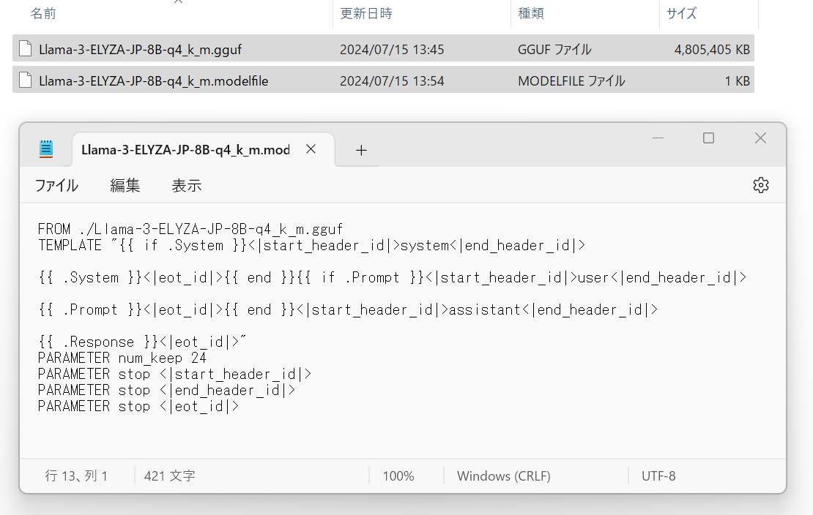

# PC上でLLMを試す

## 試している環境

* OS : Windows 11

## Ollamaのセットアップ

1. [https://ollama.com/](https://ollama.com/)からセットアップをダウンロードする
2. OllamaSetup.exeを実行してインストールする
3. powershellを開いてollama.exeを実行する
   * 使い方が表示される

### phi3の試用

phi3:

* [https://azure.microsoft.com/ja-jp/products/phi-3](https://azure.microsoft.com/ja-jp/products/phi-3)
* Microsoftの小規模言語モデル

次のコマンドでphi3でチャットを開始できる:

```
PS> ollama.exe run phi3
```

### llama3の試用

次のコマンドでllama3でチャットを開始できる:

```
PS> ollama.exe run llama3
```

これで実行されるのは8Bのllama3だった.


## 日本語を使いたい

### ELYZAを試す

参考: [https://qiita.com/s3kzk/items/3cebb8d306fb46cabe9f](https://qiita.com/s3kzk/items/3cebb8d306fb46cabe9f)

1. Hugging FaceからLlama-3-ELYZA-JP-8B-q4_k_m.ggufをダウンロードする
   * URL: [https://huggingface.co/elyza/Llama-3-ELYZA-JP-8B-GGUF/tree/main](https://huggingface.co/elyza/Llama-3-ELYZA-JP-8B-GGUF/tree/main)

2. Modelfileを作成する
   * llama3と同じテンプレートとのことなのでllama3のテンプレートを基に作成する
   * llama3のテンプレートを確認するコマンド: `PS> ollama show --modelfile llama3`  
   * Fromをダウンロードしたファイルのパスに書き換える
   * 
   * 仮に Llama-3-ELYZA-JP-8B-q4_k_m.modelfile というファイル名とする
   * UTF-8で保存した

サンプル:
```
FROM ./Llama-3-ELYZA-JP-8B-q4_k_m.gguf
TEMPLATE "{{ if .System }}<|start_header_id|>system<|end_header_id|>

{{ .System }}<|eot_id|>{{ end }}{{ if .Prompt }}<|start_header_id|>user<|end_header_id|>

{{ .Prompt }}<|eot_id|>{{ end }}<|start_header_id|>assistant<|end_header_id|>

{{ .Response }}<|eot_id|>"
PARAMETER num_keep 24
PARAMETER stop <|start_header_id|>
PARAMETER stop <|end_header_id|>
PARAMETER stop <|eot_id|>
```


3. Ollamaモデルを作成する
   * `PS> ollama create elyza:JP8B -f .\Llama-3-ELYZA-JP-8B-q4_k_m.modelfile`
   * 作成が成功すると `ollama list` コマンドで追加されたことを確認できる

4. 実行する
   * `PS> ollama run elyza:JP8B`